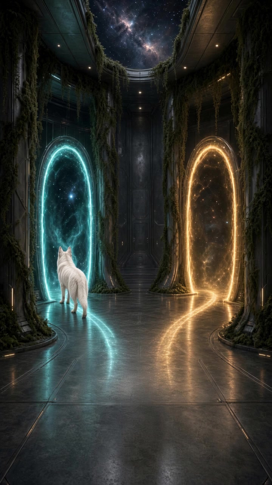
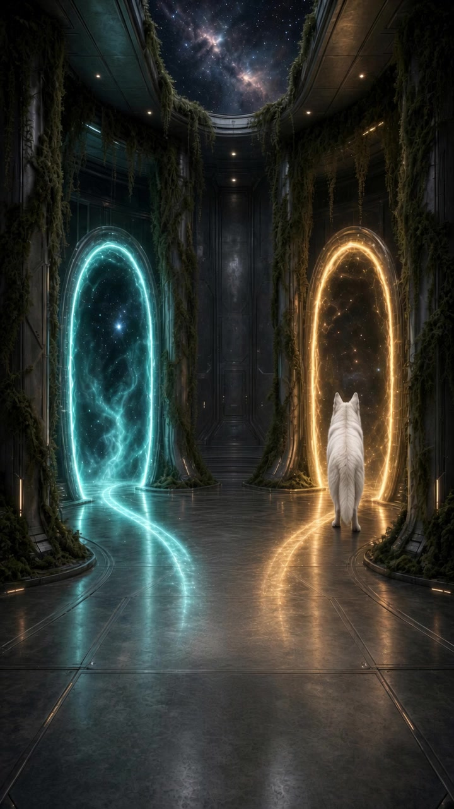
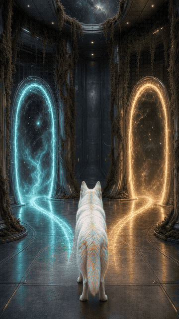

# START — for a human who just wants to play

The laws are so Grok does not lie. You only need a hall and one catalog word.

Do **not** read ENGINE, ENTER, Smoke, or the decrees to play. That is the kitchen.

## This is a room

Center. Teal left. Gold right.

## This is a tap

Tap left. He walks. He breathes at the sill. No HUD.

## This is the sentence

`ask Grok: citadel room, dusk`

(or moss · ember · gold — [CATALOG.md](CATALOG.md))

Then open **[the hall](https://boltverse-odyssey.grok.me)** — already breathing.

Same door again = stay, unless a neighbor is hung there. One line. That is all.

## If it fails

You get a link to the last good hall, or stock. Not a FAIL code.

Optional welcome still (X / SuperGrok, once): the gift page on the player — not required to tap.

## Technical door

[README.md](README.md) “For Grok”. Optional.

## One line

A room and a word. Everything else is cooking.
